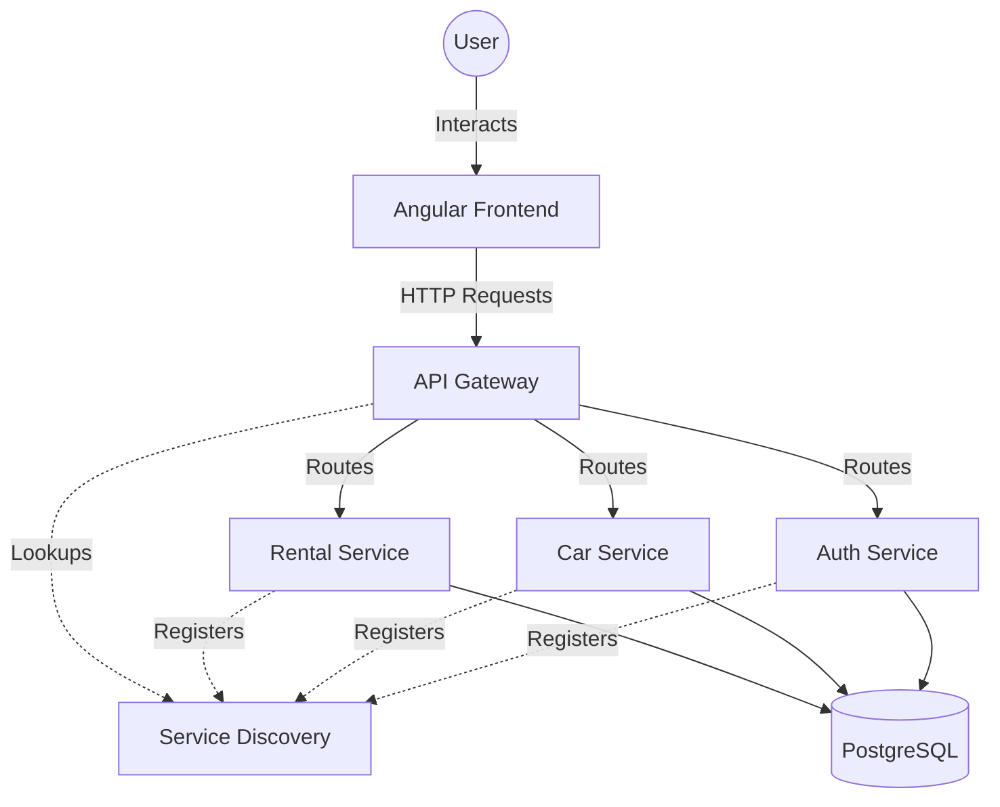

# 🚗 Full Stack Car Management System


> **A modern, distributed, and robust Car Management System built with a microservices architecture.**

---

## 📖 Overview

The **Full Stack Car Management System** is a comprehensive solution designed to streamline the management of vehicle fleets and rental operations. It leverages the power of **Microservices** to ensure scalability, maintainability, and fault tolerance. 

The application features a sleek, responsive **Angular** frontend that interacts with a distributed **Spring Boot** backend, orchestrating services for authentication, car inventory, and rental processing.

## 🏗️ Architecture

The system is built on a Microservices architecture, using **Spring Cloud** for orchestration.



## ✨ Key Features

- **🔐 Secure Authentication**: Robust JWT-based authentication and role-based access control.
- **🚙 Car Inventory Management**: Full CRUD capabilities for vehicle listings, including specifications, pricing, and status.
- **📅 Rental Operations**: Seamless rental booking, tracking, and management workflow.
- **🔎 Smart Search & Filtering**: Advanced filtering options to find the perfect car.
- **📱 Responsive Design**: A modern UI that works perfectly across desktop and mobile devices.
- **📡 Service Discovery**: Dynamic service registration and discovery using Netflix Eureka.
- **🚪 API Gateway**: Centralized entry point using Spring Cloud Gateway (or Zuul) for routing and load balancing.

## 🛠️ Technology Stack

### Frontend
- **Framework**: Angular 18+
- **Styling**: SCSS / CSS
- **HTTP Client**: RxJS based HTTP communication

### Backend
- **Framework**: Spring Boot 3.x
- **Build Tool**: Maven
- **Database**: PostgreSQL
- **Security**: Spring Security, JWT

### Infrastructure & Cloud
- **Service Discovery**: Netflix Eureka
- **API Gateway**: Spring Cloud Gateway
- **Containerization**: (Optional: Docker support ready if applicable)

## 🚀 Getting Started

Follow these instructions to get the project up and running on your local machine.

### Prerequisites
- **Java JDK 17+** installed.
- **Node.js 18+** and **npm** installed.
- **PostgreSQL** installed and running.
- **Maven** installed (or use the included `mvnw` wrapper).

### 🔧 Installation & Setup

#### 1. Database Setup
Create the necessary PostgreSQL database(s). Based on configuration:
```sql
CREATE DATABASE carmanagement_car;
-- Create other databases as required by auth and rental services
```

#### 2. Backend Setup
Navigate to the backend directory and start the services in the following order:

1.  **Service Discovery** (`service-discovery`)
2.  **API Gateway** (`api-gateway`)
3.  **Auth Service** (`auth-service`)
4.  **Car Service** (`car-service`)
5.  **Rental Service** (`rental-service`)

For each service:
```bash
cd car-management-system/<service-name>
./mvnw spring-boot:run
```

#### 3. Frontend Setup
Navigate to the frontend directory:
```bash
cd car-management-system-front-end
npm install
npm start
```
The application will be available at `http://localhost:4200`.

## 📚 API Documentation

The backend services expose RESTful APIs. 
- **API Gateway Base URL**: `http://localhost:8080` (Default Port)
- **Eureka Dashboard**: `http://localhost:8761`

## 🤝 Contributing

Contributions are welcome! Please follow these steps:
1.  Fork the repository.
2.  Create a feature branch (`git checkout -b feature/AmazingFeature`).
3.  Commit your changes (`git commit -m 'Add some AmazingFeature'`).
4.  Push to the branch (`git push origin feature/AmazingFeature`).
5.  Open a Pull Request.

## 📄 License

Distributed under the MIT License. See `LICENSE` for more information.

---

<p align="center">
  Built with ❤️ by <a href="https://github.com/PhantomVisible">Amine</a>
</p>

<p align="center">
  Here's My LinkedIn page drop a ❤️ <a href="https://www.linkedin.com/in/amine-el-haouat/">Amine El Haouat</a>
</p>
